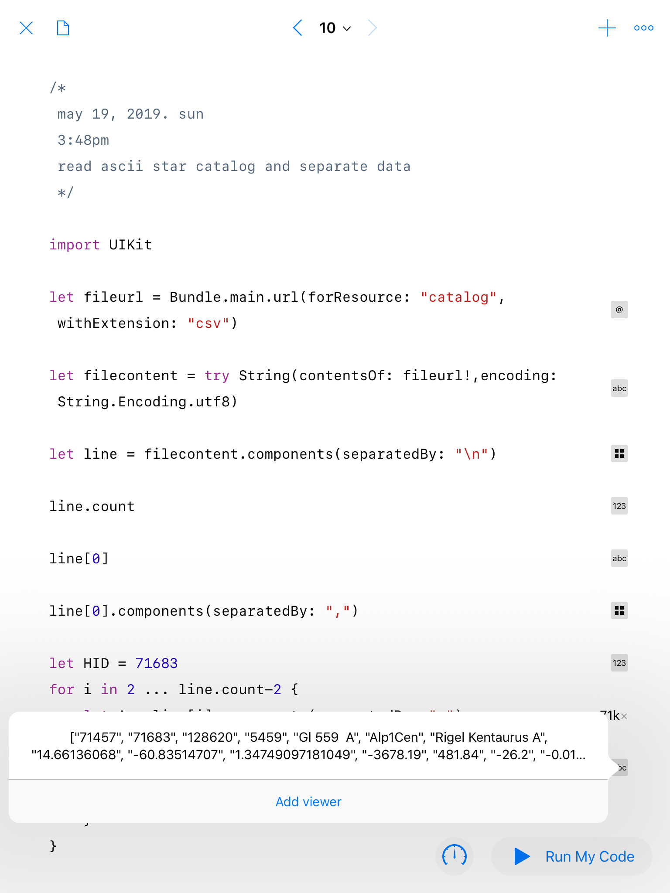

# ARKit-Stereoscope-Hipparcos (under construction)
Render Hipparcos Catalogue of 119,617 stars with ARKit and SceneKit.

Apple has updated iOS Swift Playgrounds 3.0 on May 14, 2019. There is now a simple way to turn off Swift Playgrounds logging every objects created during runtime (little boxes that appears on the right side when "Run My Code", useful for inspection and debugging but consume memory).

In Swift Playgrounds 3.0, a "Blank" template has a switch "Enable Results" for turning off logging. Now Playgrounds can add, for example, 100,000 spheres in a scene!

# Hardware

Tested on Apple 2018 9.7" iPad (A9 CPU or higher for ARKit).

The OWL Stereoscopic Viewer(£15.00) from [The London Stereoscopic Company Ltd](https://www.londonstereo.com/)

https://github.com/Physicslibrary/ARKit-Stereoscope-67P explains how to use the stereoscope with an 9.7" iPad.

# Software

Apple Swift Playgrounds 3.0 from iOS App Store. Swift Playgrounds lets kids ages ~4 and Up program their iPad directly to experiment with ARKit and Scenekit.

There is no Blender for iOS and is optional for a tutorial.

https://www.blender.org/

# Installation

With Swift Playgrounds 3.0 update, the file structure has changed from 2.2.

To keep things simple, a source file learn.swift is available for pasting into Playgrounds. Resources the program require will either be made available or links given. Use "Clone or download" to get zipped file onto an iPad. Unzip file in Apple Files app or a third-party file manager (eg. GoodReader).

Go to https://www.cv.nrao.edu/~bkent/blender/tutorials.html and tutorial "Reading data: Basic ASCII files". Get catalog.zip. It contains two files: hipparcos.blend and catalog.csv.

Open a new "Blank" template in iOS Swift Playgrounds. Copy and paste the texts of learn.swift.

Press "+" on upper right and select the third icon (folded paper). Insert catalog.csv.

Before "Run My Code", turn off "Enable Results".

The Sun is located (0,0,0) on the RGB axis. All positions of stars are placed relative to this axis.

This playground doesn't look for a flat plane to put virtual objects on, instead the initial position of the iPad is the world origin when "Run My Code" is pressed.

Virtual objects are positioned and oriented according to this world origin (with righteye.debugOptions on, the world origin is the XYZ or RGB axis).

If frame rate <60Hz, hold iPad still, press iPad HOME button, return to Swift Playgrounds. Dropping frame rate is not critical as one usually travel slowly through a star field.

# How it works

The 20MB catalog.csv contains data on 119,617 stars. Use Blender, hipparcos.blend, and https://www.youtube.com/watch?v=C3u2Gkdgxfw to learn how to read and display catalog.csv in another complimentary environment. We want to extract the HID, ProperName, and X, Y, and Z positions of the stars in Playgrounds.

 How to read and display the first ASCII line in catalog.csv. Each line is separated by "\n". In each line, values like HID, ProperName, X, Y, and Z are separated by ",".

<pre>
import UIKit

let fileurl = Bundle.main.url(forResource: "catalog", withExtension: "csv")
let filecontent = try String(contentsOf: fileurl!,encoding: String.Encoding.utf8)
let line = filecontent.components(separatedBy: "\n")

line.count

line[0]
line[0].components(separatedBy: ",")

let HID = 71683

for i in 2 ... line.count-2 {
    let A = line[i].components(separatedBy: ",")
    if Int(A[1]) == HID {
        print(A)
        break
    }
}
</pre>

With "Enable Results" on.

Go to https://www.cosmos.esa.int/web/hipparcos/common-star-names and try different HID numbers. Some HID doesn't have a ProperName.

For example, HID 71683 is named "Rigel Kentaurus A" and its distance is 1.34 parsec. Rigel Kentaurus A is part of a triple star system called Alpha Centauri that is the nearest star system to the Sun.

The rest of Contents.swift is basically the same as ARKit-Stereoscope-67P. Displaying thousands of stars in SceneKit with ARKit is possible with Playgrounds 3.0 update. There is still a memory limit on a 2018 9.7" iPad with 2GB of RAM. The solution to not being able to display all 119,617 stars is to add a variable "parsec" which will only plot stars within a certain distance.

# References

https://www.cosmos.esa.int/web/hipparcos/home

https://en.wikipedia.org/wiki/Hipparcos

https://www.cv.nrao.edu/~bkent/blender/thebook.html

https://www.cv.nrao.edu/~bkent/blender/tutorials.html

https://en.wikipedia.org/wiki/Parsec

https://stars.chromeexperiments.com/

https://www.html5rocks.com/en/tutorials/casestudies/100000stars/

http://astronexus.com/

https://github.com/astronexus/HYG-Database

https://www.apple.com/ca/swift/playgrounds/

https://developer.apple.com/swift-playgrounds/release-notes/

Copyright (c) 2019 Hartwell Fong
